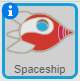

## Challenge: improve your animation

Can you change the numbers in your animation code so that:

+ The spaceship moves until it touches the Earth?
+ The spaceship moves more slowly towards the Earth?

You'll need to change the numbers in this block:

[[[generic-scratch-coordinates]]]
