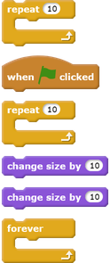
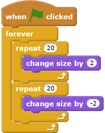

## Shining star

Now you will combine loops to make a shining star.

--- task ---
Add a 'star' sprite to your stage.

--- /task ---

--- task ---
Can you add code to your star sprite to make the star repeatedly grow and shrink?

--- hints ---
--- hint ---
When the green __flag is clicked__, your star sprite should __change size__ to get bigger a few times, and then __change size__ to get smaller a few times. It should do this so that it gets bigger and then smaller __forever__ and looks like it's shining light.
--- /hint ---
--- hint ---
Here are the code blocks you need:

--- /hint ---
--- hint ---
Here's the code to make your star grow and shrink:

--- /hint ---
--- /hints ---
--- /task ---
